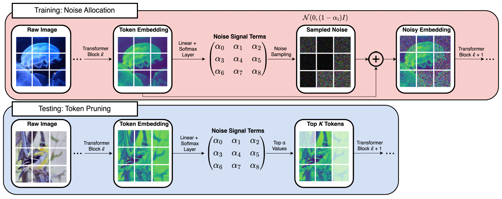
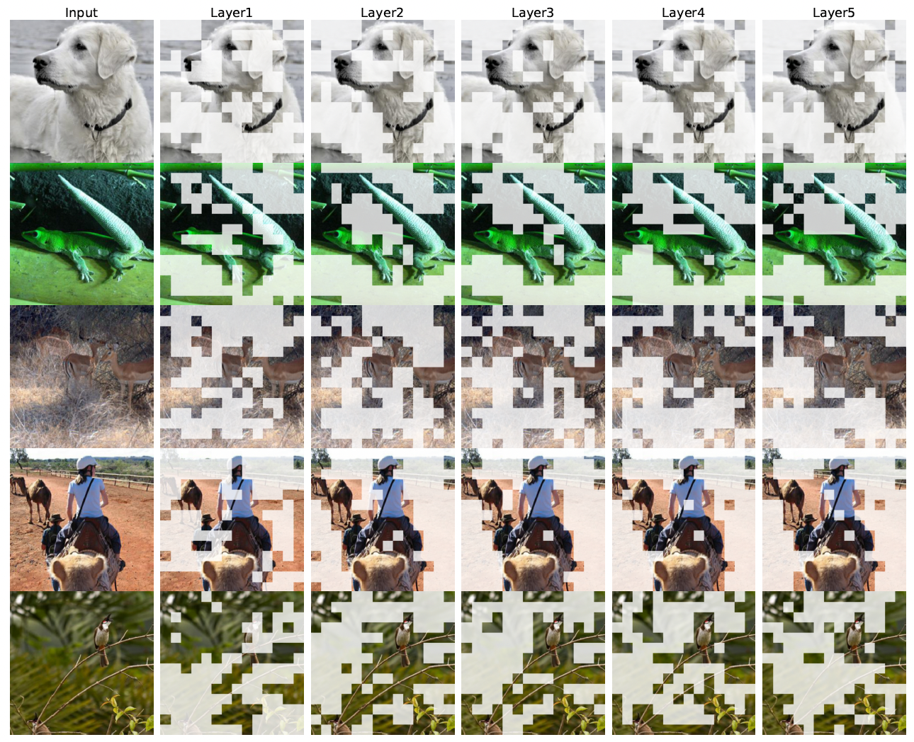

# Training Noise Token Pruning

This repository contains PyTorch implementation for **TNT**.

In the present work we present Training Noise Token (**TNT**) Pruning for vision transformers. Our method relaxes the discrete token dropping condition to continuous additive noise, providing smooth optimization in training, while retaining discrete dropping computational gains in deployment settings. We provide theoretical connections to Rate-Distortion literature, and empirical evaluations on the ImageNet dataset using ViT and DeiT architectures demonstrating TNT's advantages over previous pruning methods. 


arXiv version is available at [https://arxiv.org/pdf/2411.18092](https://arxiv.org/pdf/2411.18092)


### Model Overview



---

### Image Examples




## Model Checkpoints
| base model | url | TNT model | url |
| --- | --- | --- | --- |
| DeiT-Base-Distil. | [link](https://dl.fbaipublicfiles.com/deit/deit_base_distilled_patch16_224-df68dfff.pth) | DeiT-Base-Distil. | [link](https://vanderbilt.box.com/s/u2zx7mw59oijh3lht7c94iadp0d5vx3w) |
| DeiT-Small-Distil. | [link](https://dl.fbaipublicfiles.com/deit/deit_small_distilled_patch16_224-649709d9.pth) | DeiT-Small-Distil. | [link](https://vanderbilt.box.com/s/xx0sszg3zmdfzw7kiwrwnijruysptkap) |
| DeiT-Tiny-Distil. | [link](https://dl.fbaipublicfiles.com/deit/deit_tiny_distilled_patch16_224-b40b3cf7.pth) | DeiT-Tiny-Distil. | [link](https://github.com/mx-ethan-rao/tnt) |
| ViT/16 | [link](https://github.com/mx-ethan-rao/tnt) | ViT/16 | [link](https://github.com/mx-ethan-rao/tnt) |


---


## Usage

### Requirements

- torch>=1.8.0
- torchvision>=0.9.0
- timm==0.3.2
- six
- fvcore

**Data preparation**: Download and extract ImageNet train and val images from https://www.kaggle.com/datasets/sautkin/imagenet1k0.
The directory structure is the standard layout for the torchvision [`datasets.ImageFolder`](https://pytorch.org/docs/stable/torchvision/datasets.html#imagefolder), and the training and validation data is expected to be in the `train/` folder and `val` folder respectively:

```
/path/to/imagenet/
  train/
    class1/
      img1.jpeg
    class2/
      img2.jpeg
  val/
    class1/
      img3.jpeg
    class2/
      img4.jpeg
```


### Jupyter Notebook Demo

On the way...

### Evaluation

To evaluate a pre-trained TNT model on ImageNet val with a single GPU run:

**Deit-Base-Distil.**

Full tokens ref.:
```
* Acc@1 82.548 Acc@5 96.204 GFLOPs: 17.68 loss 0.715
```

Pruning at 3rd layer (single-layer pruning), run:
```
python main.py --eval --batch-size 128 --resume /path/to/tnt_deit_base_distil.pth --model deit_base_distilled_patch16_224 --data-path /path/to/imagenet --pru_loc 2 --keep_rate 0.6 --sim_pru 25
```
This should give
```
* Acc@1 81.574 Acc@5 95.594 GFlops 12.30 loss 0.758
```

Pruning at {2,3,4} layers (multi-layer pruning), run:
```
python main.py --eval --batch-size 128 --resume /path/to/tnt_deit_base_distil.pth --model deit_base_distilled_patch16_224 --data-path /path/to/imagenet --pru_loc 2,3,4 --keep_rate 0.8,0.8,0.8 --sim_pru 40
```
This should give
```
* Acc@1 79.844 Acc@5 94.746  GFlops 9.34 loss 0.827
```


**Deit-Small-Distil.**

Full tokens ref.: 
```
* Acc@1 80.494 Acc@5 95.190 GFLOPs: 4.63 loss 0.780
```

Pruning at 3rd layer (single-layer pruning), run:
```
python main.py --eval --batch-size 128 --resume /path/to/tnt_deit_small_distil.pth --model deit_small_distilled_patch16_224 --data-path /path/to/imagenet --pru_loc 2 --keep_rate 0.6 --sim_pru 25
```
This should give
```
* Acc@1 79.358 Acc@5 94.548 GFlops 3.20 loss 0.825
```

Pruning at {2,3,4} layers (multi-layer pruning), run:
```
python main.py --eval --batch-size 128 --resume /path/to/tnt_deit_small_distil.pth --model deit_small_distilled_patch16_224 --data-path /path/to/imagenet --pru_loc 2,3,4 --keep_rate 0.8,0.8,0.8 --sim_pru 40
```
This should give
```
* Acc@1 78.006 Acc@5 93.832 GFlops 2.42 loss 0.887
```


### Training

To train Dynamic Spatial Sparsification models on ImageNet, run:

(You can train models with different keeping ratio by adjusting ```base_rate```. )

**DeiT-Base-Distil.**

```
torchrun --nproc_per_node=8 main.py --model deit_small_distilled_patch16_224 --batch-size 256 --data-path /path/to/imagenet --output_dir /path/to/save --finetune /path/to/deit_small_distilled_patch16_224-649709d9.pth --epochs 40
```

**DeiT-Small-Distil.**

```
torchrun --nproc_per_node=8 main.py --model deit_base_distilled_patch16_224 --batch-size 256 --data-path /path/to/imagenet --output_dir /path/to/save --finetune /path/to/deit_base_distilled_patch16_224-df68dfff.pth --epochs 40
```


## License

MIT License

## Acknowledgements

Our code is based on [DeiT](https://github.com/facebookresearch/deit) and [pytorch-image-models](https://github.com/rwightman/pytorch-image-models)

## Citation

```
@article{rao2024tnt,
  title={Training Noise Token Pruning},
  author={Rao, Mingxing and Jiang, Bohan and Moyer, Daniel},
  journal={arXiv preprint arXiv:2411.18092},
  year={2024}
}
```